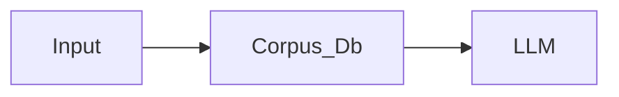
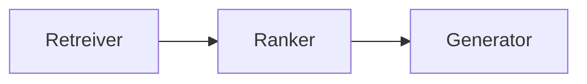
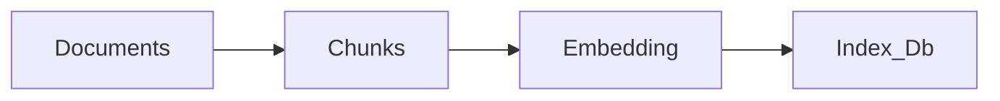

- This LLM model has access to (retrieved) support documents for a query.



- RAG Models retrieve documents and pass them to seq2seq model.
- Returns answer along with the document
- Claimed to reduce hallucination
- Good for:
	- Multi-document QA via fancy decoding, e.g., RAG-tok
	- Dialogue, QA, fact-chceking, slot filling, entity-linking
	- Non-parametric: the same model can answer questions about any corpus, just add the new corpus.
- Can be trained E2E


## RAG Framework




Retreiver techniques:
1. Vector Simulatory Search
2. Keyword based search
3. Document Retriever
4. Structured Database Query


## RAG Techniques:
#### 1. RAG Sequence:
- The model retrieves set of relevant documents or information for each input query, and then considers all these documents together to generate a single cohesive response.

#### 2. RAG Token:
- For each part of the response (sentence/word), the model retrieves relevant documents; thus response is constructed incrementally.


## RAG Pipeline

 ![[RAG Pipeline.png]]
1. Ingestion:

2. Retrieval:
	```mermaid
	flowchart LR
		Query --> Index_Db --> Top_k_results
	```
3. Generation:
	```mermaid
	flowchart LR
		Top_k_results --> Response_to_user
	```

## RAG Application Example

![[RAG Application.png]]

## RAG Risks of Hallucination:
1. Retriever may fail to get relevant information
2. Response generated by Generator is based more on its training data rather than the document retrieved.
3. RAG retrieves information, and is able to form a grounded response but yet still fails to answer the user query.


## RAG Evaluation:
1. Context Relevance: Is the retrieved context relevant to the query?
2. Groundedness: Is the response supported by the context?
3. Answer Relevance: Is the answer relevant to the query?

