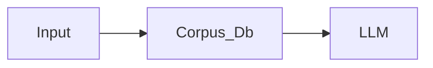

- This LLM model has access to (retrieved) support documents for a query.

- Returns answer along with the document
- Claimed to reduce hallucination
- Good for:
	- Multi-document QA via fancy decoding, e.g., RAG-tok
	- Dialogue, QA, fact-chceking, slot filling, entity-linking
	- Non-parametric: the same model can answer questions about any corpus, just add the new corpus.
- Can be trained E2E

